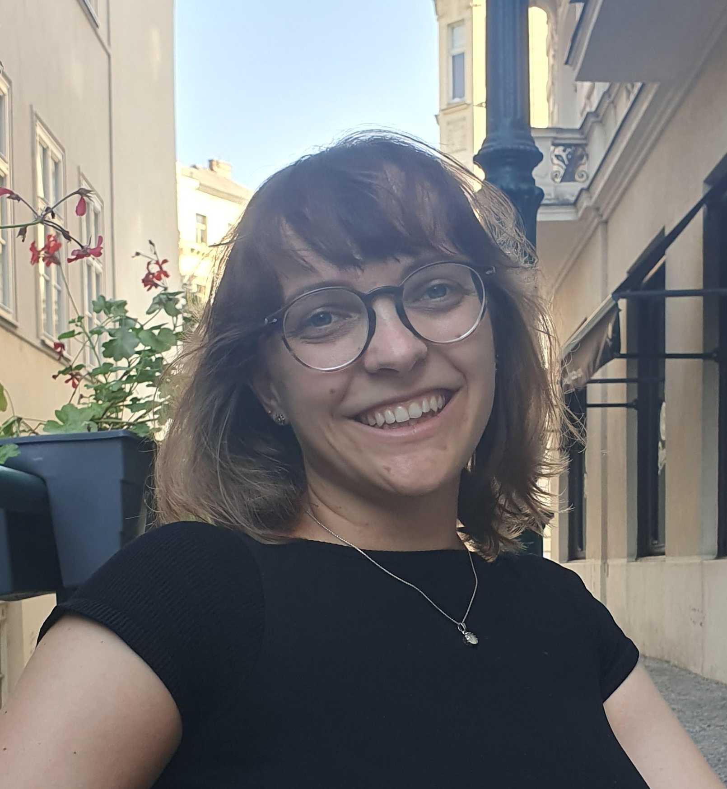

---
# Feel free to add content and custom Front Matter to this file.
# To modify the layout, see https://jekyllrb.com/docs/themes/#overriding-theme-defaults

layout: home
---

I am a PhD student in Machine Learning at the [Max Planck Institute for Intelligent Systems in Tübingen](https://is.mpg.de) supervised by [Bernhard Schölkopf](https://is.mpg.de/~bs). I am part of the [IMPRS-IS graduate program](https://imprs.is.mpg.de/scholars) and the interdisciplinary track of the [ELLIS PhD program](https://ellis.eu/phd-postdoc) where I am co-supervised by [Alessandra Buonanno](https://www.aei.mpg.de/alessandra-buonanno).

My research focuses on developing and adopting state-of-the-art Machine Learning methods to fascinating physics problems ranging from gravitational waves 🌌 to particle physics ⚛️. During my PhD, I am working on simulation-based inference and neural posterior estimation for gravitational wave signals as a developer of the [DINGO](https://dingo-gw.readthedocs.io/en/latest/index.html) package.

You can find me on [🐙Github](https://github.com/annalena-k), [🎓Google Scholar](https://scholar.google.com/citations?user=GOCdveAAAAAJ&hl=de&oi=ao), [💼 LinkedIn](https://de.linkedin.com/in/annalena-kofler-0baa39190), [🦋 BlueSky](https://bsky.app/profile/annalenakofler.bsky.social), and [🐦Twitter](https://twitter.com/AnnalenaKofler).

➡️ _Are you looking for a Master's thesis topic at the intersection of ML and physics starting in fall 2026? Perfect, drop me an email explaining your background, qualifications, and interests._

# News
* (March 2026) 🏆 I have been selected for the [Lindau Nobel Laureate meeting 2026](https://is.mpg.de/en/news/annalena-kofler-and-daniela-macari-selected-to-join-the-75th-lindau-nobel-laureate-meeting)!
* (March 2026) 💬 I will give a talk at [Merantix](https://www.merantix-aicampus.com) about [AI for gravitational waves](https://www.merantix-aicampus.com/event/ai4science---ai-for-gravitational-waves)! There will be Pizza 🍕
* (December 2025) 🌀 New paper available: ["Flexible Gravitational-Wave Parameter Estimation with Transformers"](https://arxiv.org/abs/2512.02968) which got accepted at the NeurIPS workshop _Machine Learning and the Physical Sciences 2025_!
* (September 2025) 🌊 I will give two talks at the [MIAPbP workshop "Build big or build smart: Examining scale and domain knowledge in machine learning for fundamental physics"](https://www.munich-iapbp.de/activities/activities-2025/machine-learning/schedule), stay tuned!
* (July 2025) 🐦 You want to know what ravens and gravitational waves have in common? Join my talk at the [Soapbox Science Event Tübingen](https://uni-tuebingen.de/universitaet/equity/aktuelles-gender/newsfullview-aktuelles/article/soapbox-science-tuebingen/)!
* (May 2025) ⚛ My paper ["Flow Annealed Importance Sampling Bootstrap meets Differentiable Particle Physics"](https://iopscience.iop.org/article/10.1088/2632-2153/addbc1) got accepted at _Machine Learning: Science and Technology_.
* (January 2025) 🎥 The [recording](https://neurips.cc/virtual/2024/105793) from my ML4PS spotlight talk is online.
* (December 2024) ✈️  I am attending NeurIPS in Vancouver. Reach out if you want to chat!
* (November 2024) 🏆 My paper ["Flow Annealed Importance Sampling Bootstrap meets Differentiable Particle Physics"](https://arxiv.org/abs/2411.16234) got selected for a spotlight contributed talk at the NeurIPS workshop _Machine Learning and the Physical Sciences 2024_!

[Imprint/Provider Information]()
